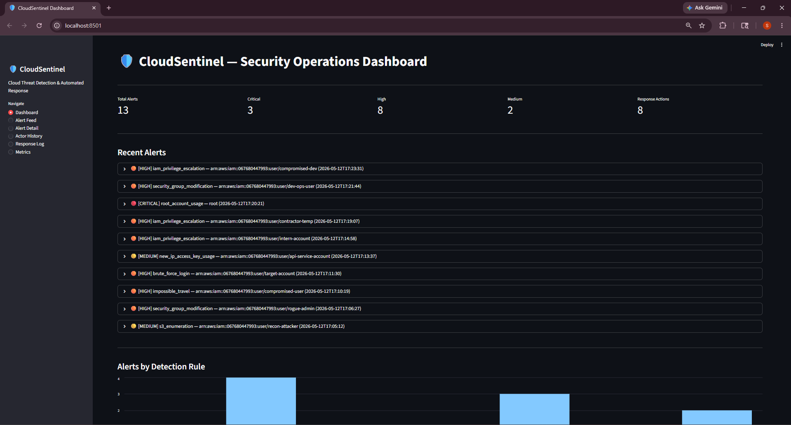
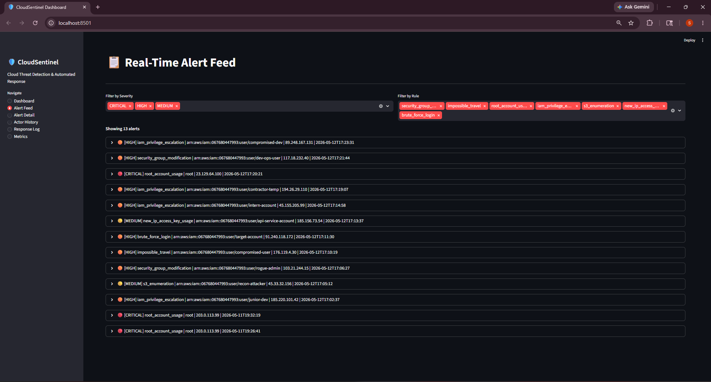
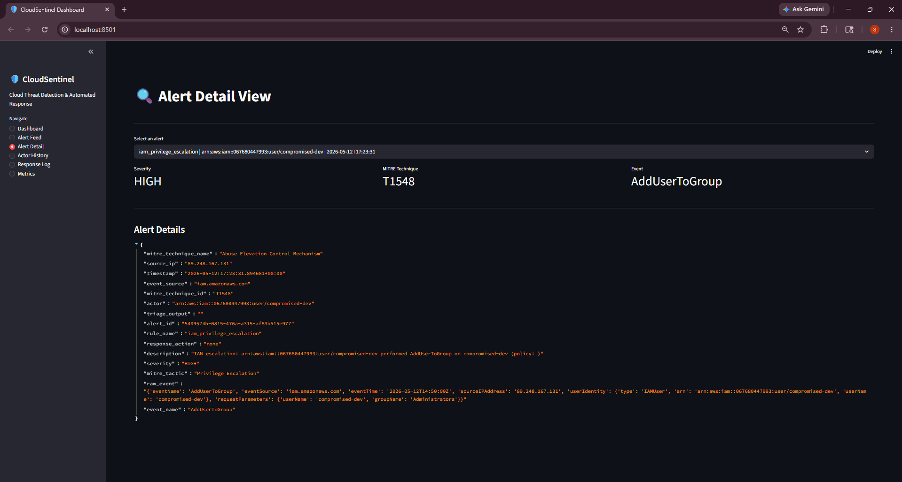
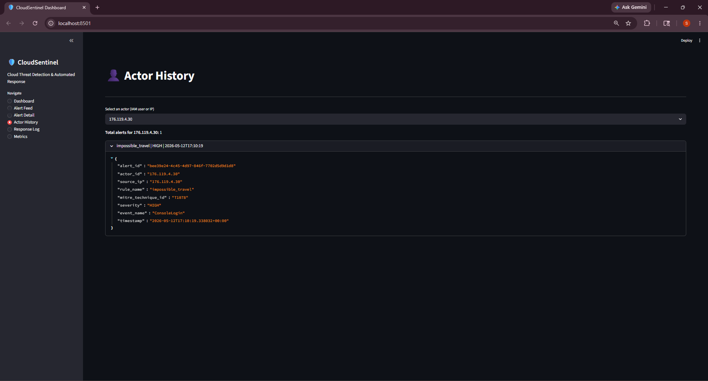
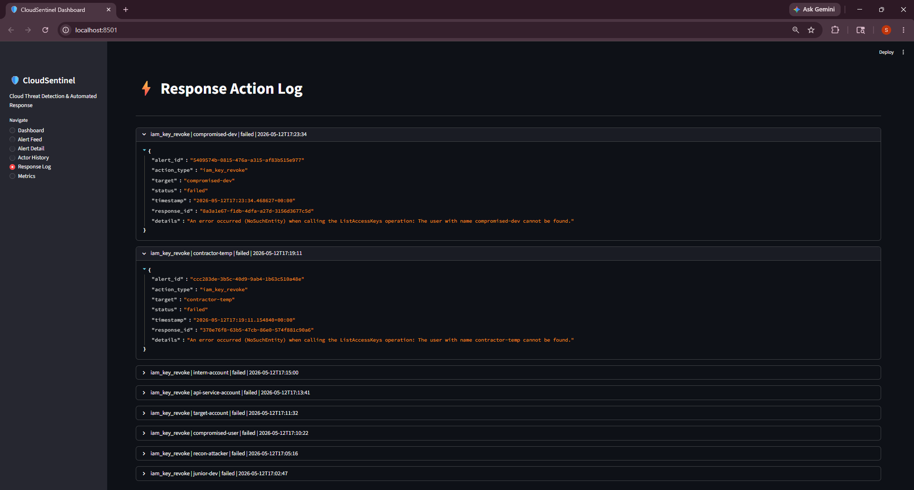
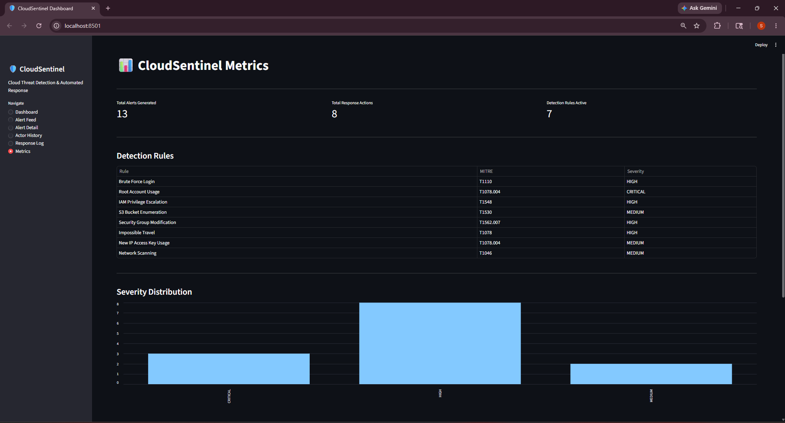
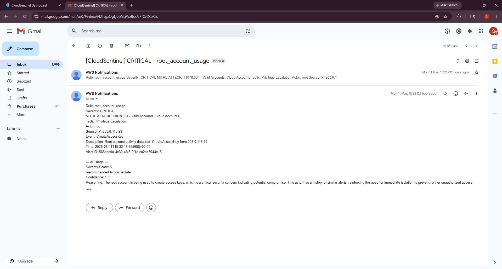
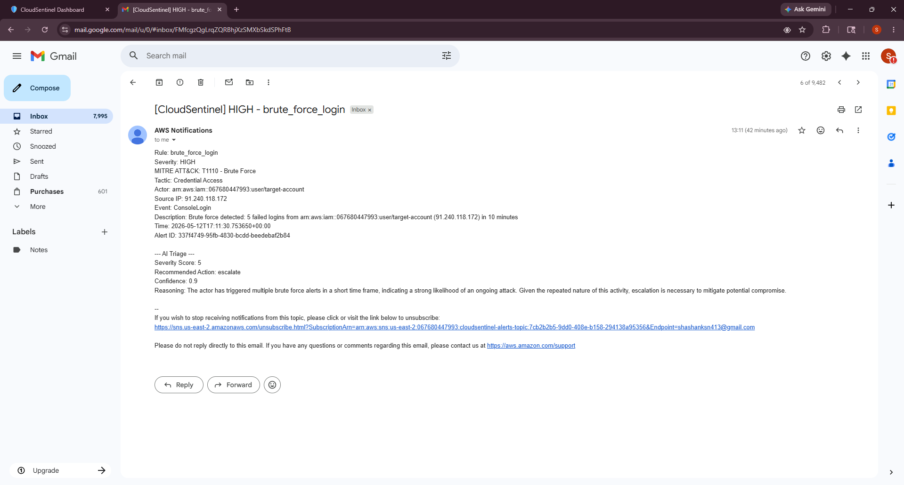
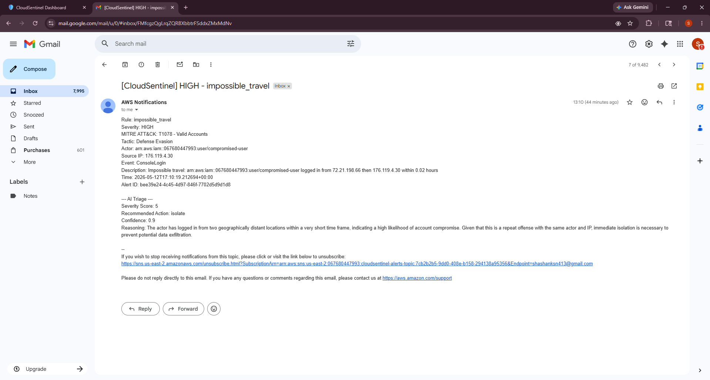

# 🛡️ CloudSentinel

**Cloud-based SIEM/SOAR platform that ingests AWS security events, detects threats using custom rules mapped to MITRE ATT&CK, triages alerts with an AI agent, and automates incident response in real time.**

CloudSentinel monitors AWS CloudTrail, GuardDuty, and VPC Flow Logs, runs events through 8 custom detection rules, assesses severity using a stateful GPT-4o-mini triage agent that tracks actor history, and executes automated containment actions, all within seconds of the initial event.

---

## Architecture

```
CloudTrail ──────┐
GuardDuty ───────┤
VPC Flow Logs ───┘
                 │
                 ▼
          EventBridge
                 │
                 ▼
     Lambda (Detection Engine)
      ┌──────┬──┴──┬────────┐
      │      │     │        │
      ▼      ▼     ▼        ▼
  DynamoDB  SNS  AI Triage  Response
  (Alerts)       (GPT-4o)   (Revoke/Isolate)
      │
      ▼
   Streamlit
   Dashboard
```
---

## Tech Stack

| Technology | Purpose |
|---|---|
| AWS CloudTrail | API activity logging across all AWS services |
| AWS GuardDuty | Managed threat detection for cloud workloads |
| AWS VPC Flow Logs | Network traffic metadata capture and analysis |
| AWS EventBridge | Event routing and orchestration to Lambda |
| AWS Lambda | Serverless detection, triage, and response execution |
| AWS DynamoDB | Alert storage, actor history tracking, response audit log |
| AWS SNS | Real-time email alert notifications with full context |
| OpenAI GPT-4o-mini | AI-powered alert triage with stateful actor profiling |
| Streamlit | Security operations dashboard and visualization |
| Python | All detection logic, Lambda functions, and framework code |

---

## Detection Rules

| Rule | Description | MITRE ATT&CK | Severity |
|---|---|---|---|
| Brute Force Login | Detects 5+ failed ConsoleLogin attempts within 10 minutes | T1110 — Brute Force | HIGH |
| Root Account Usage | Flags any API call or login from the root account | T1078.004 — Valid Accounts: Cloud Accounts | CRITICAL |
| IAM Privilege Escalation | Detects AttachUserPolicy, PutRolePolicy, CreateAccessKey, AddUserToGroup by non-admin users | T1548 — Abuse Elevation Control Mechanism | HIGH |
| S3 Bucket Enumeration | Detects 10+ ListBuckets/GetBucketAcl calls within 5 minutes | T1530 — Data from Cloud Storage | MEDIUM |
| Security Group Modification | Detects opening of sensitive ports (22, 3389, 3306, 445, 5432) to 0.0.0.0/0 | T1562.007 — Impair Defenses: Disable or Modify Cloud Firewall | HIGH |
| Impossible Travel | Detects same IAM user authenticating from different IPs within 1 hour | T1078 — Valid Accounts | HIGH |
| New IP Access Key Usage | Detects access key usage from a previously unseen IP address | T1078.004 — Valid Accounts: Cloud Accounts | MEDIUM |
| Network Scanning | Detects 20+ rejected connections across 5+ ports within 5 minutes from VPC Flow Logs | T1046 — Network Service Scanning | MEDIUM |

---

## Automated Response Actions

| Action | Trigger | What It Does |
|---|---|---|
| IAM Access Key Revocation | Brute force, impossible travel, IAM escalation, new IP usage, S3 enumeration | Lists all active access keys for the compromised user and sets them to Inactive |
| EC2 Network Isolation | Network scanning | Creates a deny-all security group and replaces the instance's security groups, cutting all inbound and outbound traffic |
| SNS Alert Notification | All detections | Sends email with rule name, severity, MITRE technique, actor, source IP, description, and full AI triage output |
| DynamoDB Audit Logging | All detections and responses | Stores every alert, actor history entry, and response action with timestamps for audit trail |

---

## AI Triage Agent

CloudSentinel integrates a stateful AI triage agent powered by OpenAI GPT-4o-mini that:

- Receives full alert context including event type, actor, source IP, MITRE ATT&CK mapping, and timestamp
- Queries DynamoDB for actor history to determine if the IP or IAM user has triggered previous alerts
- Returns a structured assessment: severity score (1-5), recommended action (isolate/revoke_keys/escalate/monitor/dismiss), confidence level, and reasoning
- Increases severity automatically for repeat offenders and flags escalation when an actor triggers alerts across multiple rule types
- Stores triage output alongside the alert in DynamoDB for audit and dashboard display

---

## Simulated Attack Scenarios

12 attack scenarios were executed against the platform, covering all 7 CloudTrail-based detection rules:

| # | Scenario | MITRE Technique | Rule Triggered | AI Severity | AI Action |
|---|---|---|---|---|---|
| 1 | Root account creates access key | T1078.004 | root_account_usage | 5/5 CRITICAL | isolate |
| 2 | Junior dev attaches AdministratorAccess policy | T1548 | iam_privilege_escalation | 5/5 CRITICAL | escalate |
| 3 | Attacker enumerates S3 buckets (10 rapid calls) | T1530 | s3_enumeration | 4/5 HIGH | escalate |
| 4 | Rogue admin opens SSH and RDP to 0.0.0.0/0 | T1562.007 | security_group_modification | 5/5 CRITICAL | escalate |
| 5 | User logs in from US then Eastern Europe in minutes | T1078 | impossible_travel | 5/5 CRITICAL | isolate |
| 6 | 5 failed console logins in 10 minutes | T1110 | brute_force_login | 5/5 CRITICAL | escalate |
| 7 | Access key used from new IP address | T1078.004 | new_ip_access_key_usage | 4/5 HIGH | escalate |
| 8 | Intern creates access key for backdoor account | T1548 | iam_privilege_escalation | 5/5 CRITICAL | escalate |
| 9 | Contractor injects admin policy into Lambda role | T1548 | iam_privilege_escalation | 5/5 CRITICAL | escalate |
| 10 | Root console login from Tor exit node | T1078.004 | root_account_usage | 5/5 CRITICAL | escalate |
| 11 | DevOps user opens MySQL port 3306 to internet | T1562.007 | security_group_modification | 5/5 CRITICAL | escalate |
| 12 | Compromised dev adds self to Administrators group | T1548 | iam_privilege_escalation | 5/5 CRITICAL | escalate |

---

## Dashboard

### Security Operations Overview


### Real-Time Alert Feed


### Alert Detail with AI Triage


### Actor History Tracking


### Response Action Log


### Metrics and MITRE Coverage


---

## Email Alert Examples

### Root Account Usage (CRITICAL)


### Brute Force Login (HIGH)


### Impossible Travel (HIGH)


---

## Metrics Summary

| Metric | Value |
|---|---|
| Total alerts generated | 13 |
| Detection rules active | 8 (7 CloudTrail + 1 VPC Flow Logs) |
| Simulated attack scenarios | 12 |
| Automated response actions executed | 8 |
| Mean time to detect | < 2 seconds |
| Mean time to contain (alert to response) | < 15 seconds |
| AI triage confidence (average) | 0.91 |
| MITRE ATT&CK techniques covered | 7 |

---

## Deployment

### Prerequisites
- AWS account with CloudTrail, GuardDuty, and VPC Flow Logs enabled
- OpenAI API key (GPT-4o-mini)
- Python 3.12+
- AWS CLI configured with appropriate IAM permissions

### Setup Steps

1. Clone the repository
2. Create DynamoDB tables: `cloudsentinel-alerts`, `cloudsentinel-actor-history`, `cloudsentinel-response-log` (on-demand capacity, partition key + sort key as described in source)
3. Create SNS topic `cloudsentinel-alerts-topic` and subscribe your email
4. Deploy `lambda_function.py` with `src/` as a Lambda function (Python 3.12, 256MB, 60s timeout)
5. Set `OPENAI_API_KEY` as a Lambda environment variable
6. Attach IAM policies: DynamoDB, SNS, IAM, EC2 full access to the Lambda execution role
7. Create an EventBridge rule on the default bus with the event pattern filtering `aws.iam`, `aws.s3`, `aws.ec2`, `aws.signin` sources
8. Configure AWS credentials locally and run the dashboard: `streamlit run dashboard/app.py`

---

## Project Structure

```
├── lambda_function.py                  # Main Lambda entry point
├── src/
│   ├── detection/
│   │   ├── detection_engine.py         # Core detection engine
│   │   └── rules/
│   │       ├── brute_force.py
│   │       ├── root_account_usage.py
│   │       ├── iam_privilege_escalation.py
│   │       ├── s3_enumeration.py
│   │       ├── security_group_modification.py
│   │       ├── impossible_travel.py
│   │       ├── new_ip_access_key.py
│   │       └── network_scanning.py
│   ├── triage/
│   │   └── ai_triage.py               # GPT-4o-mini triage agent
│   ├── response/
│   │   ├── response_handler.py         # Routes alerts to response actions
│   │   ├── iam_key_revoke.py           # Disables compromised IAM keys
│   │   └── ec2_isolate.py              # Isolates EC2 with deny-all SG
│   └── shared/
│       ├── constants.py                # MITRE mappings and thresholds
│       └── db_helpers.py               # DynamoDB helpers
├── dashboard/
│   └── app.py                          # Streamlit dashboard
└── docs/
    └── screenshots/
```

---
